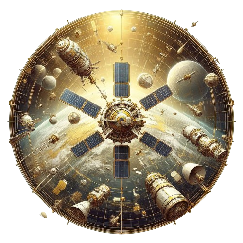

#### <p align="center">Tabla de Contenido </p>

[Descripción del Proyecto](#Descripción-del-Proyecto-) 

[Objetivo](#Objetivo-)
 - [OrbitOne](#OrbitOne-)
 - [ColonyMoon](#ColonyMoon-)
 - [VacMars](#VacMars-)
 - [TwoGalaxy](#TwoGalaxy-)
[Equipo de especialistas](#Equipo-de-especialistas-)
[Centro de operaciones](#Centro-de-operaciones-)
[Requerimientos](#Requerimientos-)
[Instrucciones de uso](#Instrucciones-de-uso-)


#  <p align="center"> 🚀 Apollo-11: Sistema de Simulación y Monitoreo para Misiones Espaciales</p>


<p align="center">  </p>


## <p align="center"> Descripción del Proyecto </p>

Desarrollado por la NASA, este sistema implementa un monitoreo basado en la transmisión de archivos con intervalos de 20 segundos, con el objetivo de proporcionar un control detallado sobre el estado operativo de cada componente clave para detectar tempranamente posibles anomalías. Esto facilita la toma de acciones preventivas tanto en el espacio como en la Tierra.


## <p align="center"> Objetivo </p>

La adopción de esta tecnología avanzada es crucial para asegurar la seguridad de astronautas y turistas en futuras misiones espaciales. Además, la capacidad de monitoreo en tiempo real proporcionada por este sistema ofrece una ventaja significativa, permitiendo una respuesta inmediata ante cualquier situación imprevista. Esto, a su vez, mejora la eficiencia y la efectividad de los siguientes proyectos espaciales:

1. 📡 **OrbitOne**: Con su visión de modernizar la flota de satélites, representa un paso crucial hacia la mejora del rendimiento y la expansión de las comunicaciones. La actualización de la flota satelital no solo implica una mayor eficiencia en cobertura, sino también una mejora significativa en la calidad de las transmisiones y la recopilación de datos. Este enfoque modernizador no solo beneficia a la comunidad científica, sino que también tiene implicaciones importantes para el avance de las tecnologías de comunicación en la Tierra.
<p align="center"> </p>


2. 🌕 **ColonyMoon**: La idea de establecer una colonia en la Luna a través de ColonyMoon es un ambicioso proyecto que podría cambiar para siempre la narrativa de la exploración espacial. Más allá de la emoción y la novedad de establecer una presencia humana en nuestro satélite natural, esta colonia lunar podría servir como un laboratorio espacial para experimentos y estudios que no serían posibles en la Tierra. Además, podría convertirse en una base de operaciones estratégica para futuras misiones espaciales más allá de nuestro sistema solar

<p align="center"></p>

3. 🌋 **VacMars**: Propone llevar a cabo viajes turísticos a Marte, llevando la exploración espacial a nuevas alturas. Este enfoque no solo proporciona oportunidades emocionan tes para los entusiastas del espacio, sino que también puede ser una fuente de financiamiento para proyectos científicos más ambiciosos. Al hacer que Marte sea accesible para los turistas, se abriría una nueva era de colaboración público-privada en la exploración espacial, creando una sinergia entre el interés comercial y la investigación científica.

<p align="center"></p>

4. 🌌 **GalaxyTwo**: La exploración de otras galaxias a través de GalaxyTwo representa un salto gigantesco en nuestro entendimiento del universo. Si bien es un proyecto de gran envergadura y desafíos técnicos significativos, la posibilidad de visitar otras galaxias nos llevaría más allá de los límites actuales de la exploración espacial. Este proyecto no solo se centraría en la expansión del conocimiento científico, sino que también podría inspirar nuevas formas de colaboración internacional en la búsqueda de respuestas a las preguntas fundamentales sobre el origen y la naturaleza del cosmos.

<p align="center"></p>

## <p align="center"> 💻 Equipo de especialistas </p>

|  Nombres |  Apellidos | Cargo  |
| :------------: | :------------: | :------------: |
| Luis Sebastian  |  Ibarra Villamil | Ingeniero de Sistemas Espaciales  |
| Leonardo Alfonso  |  Cometa Trujillo | Ingeniero de Software Espacial  |
| Alvaro Jose  | Polania Alvarez | Ingeniero de Comunicaciones Espaciales  |

## <p align="center"> 🏢 Centro de operaciones: Cabo Cañaveral </P>

<p align="center"></p>

Ubicado en la costa este de Florida, Estados Unidos, es reconocido por ser la sede del Centro Espacial Kennedy (CEK), una instalación fundamental para la exploración espacial. Este centro, antes conocido como Cabo Cañaveral Air Force Station, ha desempeñado un papel esencial en la historia de la exploración espacial.

A lo largo de los años, Cabo Cañaveral ha contribuido significativamente al desarrollo de la exploración espacial, siendo crucial en el programa Apolo y en el lanzamiento de misiones del transbordador espacial que facilitaron la construcción y mantenimiento de la Estación Espacial Internacional (EEI). La importancia de este centro no se limita a misiones de la NASA, ya que también ha atraído la atención de empresas privadas como SpaceX, que utiliza las instalaciones para lanzamientos comerciales.

## <p align="center"> 📜 Requerimientos </P>

### <p align="center"> 1. Python </P>

Asegúrese de que su sistema cumpla con los siguientes requisitos antes de comenzar la instalación:

- Conexión a Internet
- Espacio suficiente en disco
- Privilegios de administrador (en caso necesario)

#### Pasos de instalación

### Windows

1. Abra su navegador web y visite [python.org](https://www.python.org/).
2. En la sección "Downloads", haga clic en "Python for Windows".
3. Descargue el instalador ejecutable (`*.exe`) para la última versión estable.

### macOS

1. Abra su navegador web y visite [python.org](https://www.python.org/).
2. En la sección "Downloads", haga clic en "Python for macOS".
3. Descargue el instalador para la última versión estable.

### Linux

La instalación en Linux puede variar según la distribución. A continuación, se muestra un ejemplo para distribuciones basadas en Debian (como Ubuntu):

1. Abra la terminal.
2. Ejecute los siguientes comandos:

```bash
sudo apt update
sudo apt install python3
```

 :memo: **Recomendación:** Elegir la versión de Python que mejor se adapte a tus necesidades. Se recomienda utilizar la versión más reciente, a menos que tengas restricciones específicas.

### Verificación de la instalación

Abre una nueva terminal y ejecuta los siguientes comandos para verificar que Python se haya instalado correctamente:

```bash
python --version
```

## <p align="center"> 📜 Instrucciones de uso </P>

