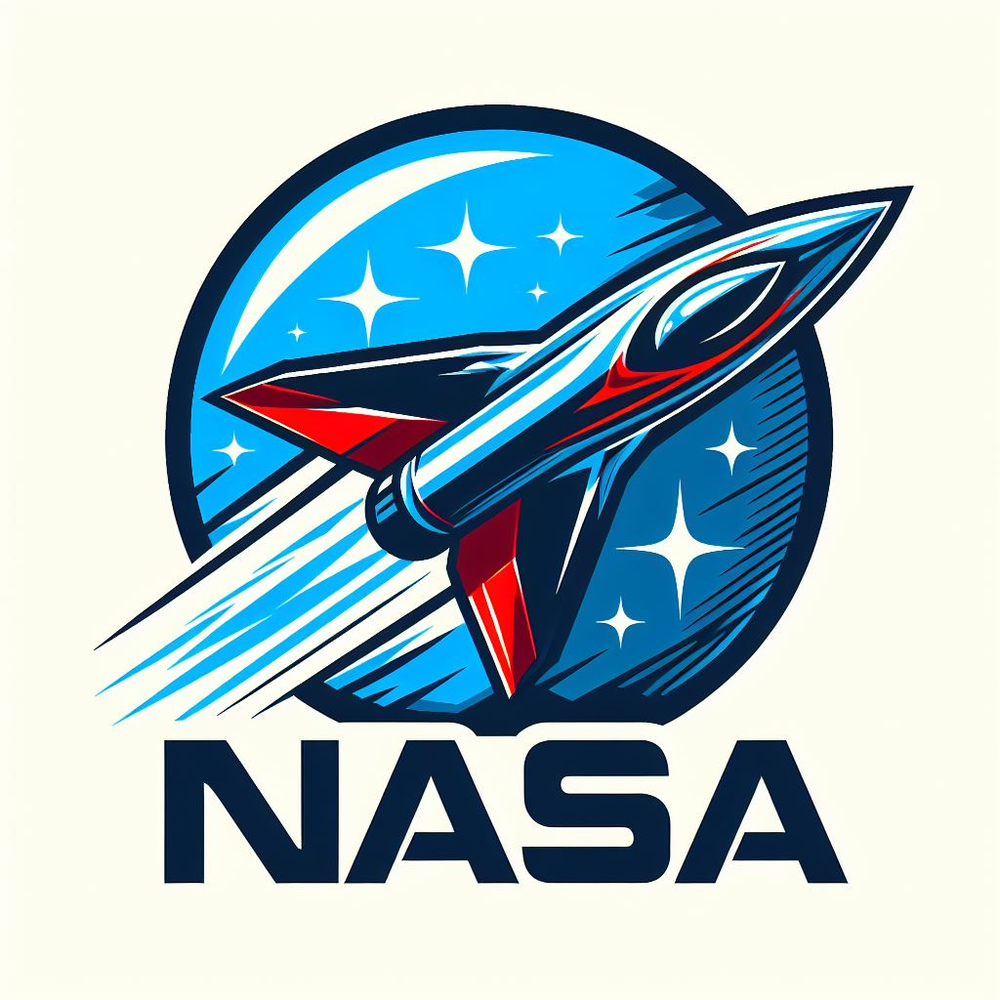
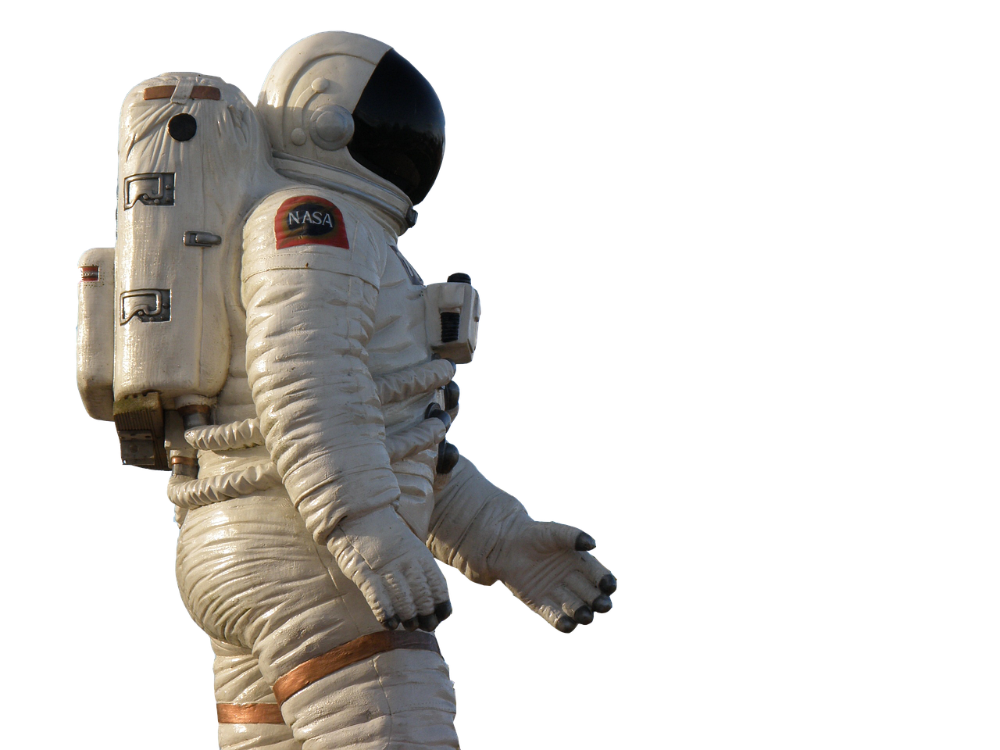

.. raw:: html

 

.. _Nasa:
NASA (National Aeronautics and Space Administration)
------------

¿Quienes somos?
------------
La Administración Nacional de la Aeronáutica y el Espacio, conocida comúnmente como NASA (National Aeronautics and Space Administration) por sus siglas en inglés, es una agencia del gobierno de los Estados Unidos encargada de supervisar el programa espacial civil, además de llevar a cabo investigaciones en los campos de la aeronáutica y la astronáutica.

Nuestro objetivo
------------
Buscamos recobrar nuestra capacidad de inspirar a nivel mundial y recuperar el protagonismo que ostentamos durante las décadas de los años 70 y 90. Con este objetivo en mente, actualmente se encuentra en desarrollo cuatro de los :ref:`proyectos <proyectos>` más ambiciosos en toda nuestra historia, donde harán uso de la más innovadora tecnología desarrollada por la humanidad y, al mismo tiempo, suscitarán una destacada expectación y atención a nivel internacional.

